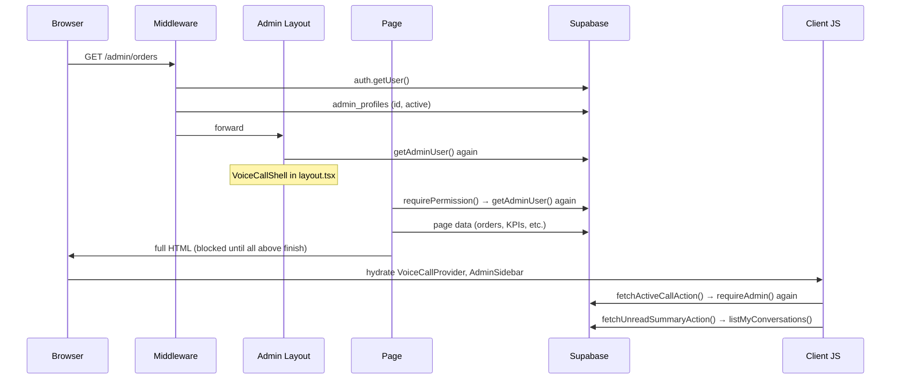

# AI Analysis — Admin Panel Speed

**Date:** June 30, 2026  
**Scope:** Why `/admin/*` pages feel slow to open, and how to make them fast  
**Method:** Static code review of auth, layout, data layer, and client hydration paths

---

## Executive summary

The admin panel is slow because **every navigation pays a fixed tax** before the page-specific work even starts: repeated Supabase auth round-trips, global client features (voice + unread messages) that fire server actions on mount, and fully blocking server rendering with no loading UI.

The worst pages (Dashboard, Analytics) add **dozens of database round-trips** and, in some cases, **load entire tables into Node.js** to compute counts in application code instead of SQL.

None of this is a single bug — it is a stack of compounding costs. Fixing the top 3 items alone should make navigation feel dramatically faster.

| Priority | Issue | Typical cost | Fix effort |
|----------|-------|--------------|------------|
| P0 | Duplicate auth (`getUser` × 2–3 per navigation) | 200–800 ms | Low |
| P0 | Global sidebar unread fetch on every route change | 300 ms–2 s | Medium |
| P0 | Voice shell auth + `fetchActiveCallAction` on every page | 200–600 ms | Low |
| P1 | Dashboard KPI = 12+ queries, many fetch full row sets | 500 ms–3 s | Medium |
| P1 | Analytics loads **all** orders into memory | 1–10+ s at scale | Medium |
| **P0** | **Fetch-first navigation** — page awaits all data before any UI renders | Perceived “eternity” on click | Medium |
| P1 | No `loading.tsx` / Suspense — blank screen until done | Compounds fetch-first UX | Low |
| P2 | Messages unread counts fetch all foreign messages | Grows with message volume | Medium |
| P2 | Orders list `select("*")` includes JSONB line items | Payload bloat | Low |
| P2 | Missing `orders(created_at)` index | Slower range queries | Low |
| P3 | Netlify serverless cold starts | 1–5 s first hit | Infra |

---

## How a page load actually works today



**Key insight:** Auth and global features run **before and after** the page you asked for. The user waits for the slowest link in the chain.

---

## Navigation UX — why clicks feel stuck (fetch-first)

This is the **most visible** slowness for staff: clicking “Orders” or “Products” in the sidebar does not feel like going to a new page — it feels like the app is frozen until data arrives.

### What happens today on sidebar click

```mermaid
sequenceDiagram
  participant User
  participant Link as Next.js Link
  participant Server
  participant Page as page.tsx

  User->>Link: click /admin/orders
  Note over User,Link: URL may update; UI stays on old page
  Link->>Server: request RSC payload for /admin/orders
  Server->>Page: await requirePermission()
  Server->>Page: await listOrdersAdmin()
  Server->>Page: await listStaffForFilter() (if super admin)
  Note over Server,Page: AdminLayout only renders AFTER all awaits
  Page->>User: full page HTML (sidebar + table together)
```

**Fetch-first pattern:** The route’s `page.tsx` is one async server component. Every `await` — auth, filters, list query — runs **before** `return <AdminLayout>…</AdminLayout>`. Next.js cannot send the new route’s UI until that function completes. The sidebar, top bar, and table are bundled in the same component tree, so **none of them appear until the slowest query finishes**.

Typical `orders/page.tsx` flow:

1. `await requirePermission("view_orders")` — auth tax
2. `await searchParams` — params
3. `await listStaffForFilter()` — extra query (super admin)
4. `await listOrdersAdmin(...)` — main query
5. **Only then** render `AdminLayout` + table

The user sees the **previous page** (or a blank stall) for the entire duration. That is why navigation feels slower than the queries themselves.

### What we want — navigate-first with skeleton

```mermaid
sequenceDiagram
  participant User
  participant Router
  participant Shell as Persistent admin shell
  participant Skeleton as loading.tsx / Suspense fallback
  participant Data as Async data component

  User->>Router: click /admin/orders
  Router->>Shell: route change immediately
  Shell->>Skeleton: show content-area skeleton (< 100ms)
  Note over User,Skeleton: Sidebar + top bar stay visible; main area pulses
  Router->>Data: stream orders query in background
  Data->>User: replace skeleton with real table when ready
```

**Navigate-first pattern:**

1. **Click → route changes immediately** — URL and active nav state update; user knows the click registered.
2. **Shell stays mounted** — sidebar and top bar do not disappear between pages.
3. **Skeleton in the content area** — table/chart placeholders show while data loads.
4. **Data streams in** — real content replaces the skeleton when queries complete.

This does not make queries faster, but it makes **2–3 second waits feel like ~100ms** because feedback is instant.

### Why our structure blocks navigate-first today

| Piece | Where it lives | Problem |
|-------|----------------|---------|
| Sidebar + top bar | Inside `AdminLayout`, rendered by each `page.tsx` | Shell is a child of the slow async page — cannot show until page `await`s finish |
| Auth | `requirePermission()` at top of every page | Gates the entire page including layout chrome |
| Page data | Same `page.tsx` as layout chrome | No split between “fast shell” and “slow content” |
| `loading.tsx` | **Missing** | Next.js has nothing to show during the RSC fetch |
| `Suspense` | **Not used** | No streaming fallback for slow blocks |

`app/admin/layout.tsx` only wraps theme + voice — it does **not** include the admin chrome staff recognize. That chrome is recreated per page behind the data wall.

### Target architecture for instant navigation

**1. Persistent admin shell in a route layout**

Move sidebar + top bar out of per-page `AdminLayout` into something like `app/admin/(panel)/layout.tsx`:

- Fetch `admin` once here (with `react.cache()`)
- Render sidebar + top bar + `{children}` slot immediately
- Pass `admin` via context so pages do not re-auth for chrome

**2. Global + per-route `loading.tsx`**

```
app/admin/
  loading.tsx              ← full-panel skeleton (fallback for any admin route)
  (panel)/
    layout.tsx             ← persistent shell (sidebar always visible)
    loading.tsx            ← content-area skeleton only (main pane)
    orders/
      page.tsx
      loading.tsx          ← orders-specific table skeleton (optional)
    dashboard/
      page.tsx
      loading.tsx
```

`loading.tsx` is what Next.js shows **the moment** navigation starts, while the server still runs `page.tsx`.

**3. Split pages into shell + streaming content**

Refactor heavy pages from:

```tsx
// Today — everything blocks together
export default async function Page() {
  const admin = await requirePermission("view_orders");
  const { orders } = await listOrdersAdmin(...);
  return (
    <AdminLayout title="Orders" admin={admin}>
      <OrdersTable orders={orders} />
    </AdminLayout>
  );
}
```

To:

```tsx
// Target — shell from layout; only data blocks
export default function Page() {
  return (
    <Suspense fallback={<OrdersTableSkeleton />}>
      <OrdersContent />
    </Suspense>
  );
}

async function OrdersContent() {
  const { orders } = await listOrdersAdmin(...);
  return <OrdersTable orders={orders} />;
}
```

Auth for **permission checks** still runs, but only inside the suspended content — the shell from the parent layout is already on screen.

**4. Reusable skeleton components**

Match existing admin UI (`AdminTable`, stat cards, filters) so skeleton → content transition does not layout-shift:

- `AdminTableSkeleton` — header row + 8–10 pulsing rows
- `AdminKpiSkeleton` — 4 stat cards
- `AdminChartSkeleton` — chart placeholder for analytics
- `AdminPageSkeleton` — generic title bar + content block

**5. Keep using `<Link>` — no custom client router**

Sidebar already uses `next/link`. No change needed for prefetch. `loading.tsx` + persistent shell is what unlocks instant feedback; do not replace with `router.push` + manual spinners unless a specific flow requires it.

### Navigation UX success criteria

| Behavior | Today | Target |
|----------|-------|--------|
| Time from click to visible change | 0 ms until server responds | < 100 ms (skeleton or shell swap) |
| Sidebar during navigation | Stale previous page or blank | Stays visible, active link updates |
| Main content during load | Frozen old content or empty | Skeleton pulses in content area |
| Time to real data | Same (query-bound) | Same — but **perceived** wait drops sharply |

---

## Root causes (detailed)

### 1. Triple auth on every admin navigation

**Where:**

- `lib/supabase/middleware.ts` — `auth.getUser()` + `admin_profiles` lookup
- `components/admin/voice/VoiceCallShell.tsx` — `getAdminUser()` in root admin layout
- Every page — `requirePermission()` / `requireAdmin()` → `getAdminUser()` again
- Client actions — `fetchActiveCallAction`, `fetchUnreadSummaryAction` each call `requireAdmin()` again

**Why it hurts:**

`getAdminUser()` (`lib/admin/auth.ts`) creates a new Supabase SSR client and calls `auth.getUser()`, which validates the session against Supabase Auth (network round-trip). This runs **independently** in layout and page because there is no `react.cache()` wrapper.

On a typical page open:

| Step | `getUser` calls | `admin_profiles` queries |
|------|-----------------|--------------------------|
| Middleware | 1 | 1 (partial) |
| Layout (`VoiceCallShell`) | 1 | 1 (full) |
| Page (`requirePermission`) | 1 | 1 (full) |
| Client mount (voice + sidebar) | 2+ via server actions | 2+ |

That is **4–6 auth round-trips** per navigation before counting page data.

**Fix direction:**

- Wrap `getAdminUser` in `react.cache()` so layout + page share one request-scoped result
- Pass `admin` from layout to children via context instead of re-fetching in `VoiceCallShell`
- Middleware already proves the user is active — page layer should trust a cached profile, not re-validate JWT separately when possible
- Client polling should use a lightweight endpoint that does not re-run full `requireAdmin()` + heavy queries

---

### 2. Global client features tax every page

#### Voice call shell (all admin pages)

`app/admin/layout.tsx` wraps every child in `VoiceCallShell`, which:

1. Awaits `getAdminUser()` server-side (blocks HTML)
2. Hydrates `VoiceCallProvider` on the client
3. On mount, calls `fetchActiveCallAction()` → another `requireAdmin()` + DB query
4. Subscribes to **two** Supabase Realtime channels permanently

Most admin pages have nothing to do with voice calls, but they still pay this cost.

**Fix direction:**

- Lazy-load voice only on `/admin/messages/*` (or when user opens a call UI)
- Defer `fetchActiveCallAction` until messages route or first user interaction
- Move realtime subscriptions behind the same gate

#### Sidebar unread badge (all admin pages)

`components/admin/AdminSidebar.tsx`:

```ts
useEffect(() => {
  fetchUnreadSummaryAction()...
}, [pathname]); // re-runs on EVERY navigation
```

`fetchUnreadSummaryAction` → `getUnreadSummary` → `listMyConversations`, which:

- Loads all conversation memberships
- Loads all conversations
- Loads all read states
- **Fetches every message not sent by the user** across all conversations to count unreads in JS

This runs on **every route change**, in addition to any server-side unread fetch (e.g. dashboard).

**Fix direction:**

- SQL `COUNT(*) ... WHERE created_at > last_read_at` per conversation (or one aggregated query / materialized view)
- Poll every 60s only, not on every `pathname` change
- Share unread count from server layout via context; client only refreshes on interval or Realtime event

---

### 3. Blocking server render with no loading states

See also **Navigation UX — fetch-first** above. This section is the technical counterpart.

- **No** `app/admin/**/loading.tsx` files exist
- Pages are async server components that `await` all data **before** returning `AdminLayout` — sidebar and table are behind the same wall
- No `Suspense` boundaries around slow sections (KPI cards, tables, charts)
- `AdminLayout` lives inside each `page.tsx`, not in a persistent route layout — so even a `loading.tsx` at `app/admin/` would flash a skeleton **without** the familiar sidebar unless we restructure

**User experience:** Click a nav link → nothing changes for seconds → entire new page pops in at once. A 2s auth stack + 3s dashboard KPIs = 5s of “did my click work?” even if some data was ready at 500ms.

**Fix direction (navigate-first):**

1. **Persistent shell** — move `AdminLayout` chrome into `app/admin/(panel)/layout.tsx` so sidebar/top bar render on every route without waiting for page data
2. **`loading.tsx`** at admin + route level — skeleton appears **on click**, not after fetch
3. **`<Suspense>`** — split each page into fast wrapper + async `*Content` component; skeleton only in the main pane
4. **Skeleton components** — `AdminTableSkeleton`, `AdminKpiSkeleton`, etc., matching real layout dimensions

---

### 4. Query anti-patterns in the data layer

#### Dashboard — `getDashboardKpiPayload()` (`lib/db/admin/analytics.ts`)

Runs **12 parallel queries**, including:

- `getOrderStatsForPeriod` × **6** (today/week/month × current + previous)
- `countOrdersByStatus` × 3
- `countActiveCoupons`, `getLowStockProducts`, `getDailySparkline`

**Problem with `getOrderStatsForPeriod`** (`lib/db/admin/orders.ts`):

```ts
let query = supabase
  .from("orders")
  .select("total")  // fetches ALL matching rows
  .gte("created_at", start)
  .lte("created_at", end)
  ...
const rows = data ?? [];
return { count: rows.length, revenue: rows.reduce(...) };
```

For a busy store, “this month” might return thousands of rows × 6 queries, all transferred to the server only to count and sum in JavaScript.

**Should be:**

```sql
SELECT COUNT(*), COALESCE(SUM(total), 0)
FROM orders
WHERE created_at BETWEEN $1 AND $2 AND status != 'returned'
```

One query per period, or a single SQL function returning all KPI buckets.

#### Analytics — `getAnalyticsData()`

```ts
let query = supabase
  .from("orders")
  .select("total, status, city, products, coupon_code, created_at, ...")
  .order("created_at", { ascending: true });
// NO LIMIT — entire orders table
```

Loads **every order** with full `products` JSONB into Node, then aggregates top products, cities, revenue series in memory.

This will scale linearly with order volume and is the primary reason Analytics feels like “eternity” as the business grows.

**Fix direction:**

- Pre-aggregated tables or Postgres functions (`date_trunc` grouping)
- Rolling window (last 90 days) for charts; full history only on export
- Move top-products / top-cities to SQL `GROUP BY` with limits

#### Orders list — over-fetching

`listOrdersAdmin` uses `.select("*, creator:...")` — the `*` includes `products` JSONB, `notes`, and other fields not shown in the list table. Fifty orders × line-item snapshots = unnecessary payload.

**Fix direction:** Explicit column list for list views.

#### Messages — unread counting

`listMyConversations` fetches **all** messages where `sender_id != userId` for all user conversations, then filters by `last_read_at` in JS. Message volume makes this O(all messages), not O(unread).

---

### 5. Missing database index

Migrations index `orders` on `order_number`, `status`, `created_by`, `source` — but **not** `created_at`.

Dashboard sparklines, period stats, and analytics all filter on `created_at` ranges. At scale this becomes a sequential scan.

**Fix:**

```sql
CREATE INDEX IF NOT EXISTS idx_orders_created_at ON orders(created_at DESC);
-- Optional composite for common filters:
CREATE INDEX IF NOT EXISTS idx_orders_created_status ON orders(created_at DESC, status);
```

---

### 6. No caching strategy

- No `react.cache()` on shared server functions
- No `unstable_cache` / `revalidate` for data that can be stale for 30–60s (KPIs, product list)
- `next.config.ts` is empty — no explicit optimizations
- Every admin page is effectively fully dynamic

For an internal admin panel, **short TTL caching** (30–60s) on KPIs and analytics is usually acceptable and massively reduces repeat load cost.

---

### 7. Infrastructure latency

Deployed on **Netlify** (`netlify.toml`). Serverless functions incur:

- **Cold starts** (1–5s) when a function has not run recently
- Extra hop vs always-on Node server

Supabase Auth + DB round-trips add latency based on region. If Netlify functions run in `us-east-1` and Supabase is in `ap-southeast-1`, every query pays ~150–250ms RTT × number of queries.

**Mitigation:**

- Co-locate Supabase project region with Netlify function region
- Reduce round-trip count (bigger win than faster hosting)
- Consider Vercel (Next.js native) if cold starts remain painful after code fixes

---

### 8. Client bundle and hydration weight

Every admin page hydrates:

- `AdminThemeProvider` (client)
- `VoiceCallProvider` (client, WebRTC logic, realtime)
- `AdminSidebar` (client, pathname listener, polling)
- `ToastProvider` (client)

Analytics pages additionally ship **Recharts** (~heavy chart library).

This does not block first byte as much as server waterfalls, but it affects **Time to Interactive** and main-thread work on lower-end devices (target audience uses mobile).

**Fix direction:**

- Dynamic `import()` for Recharts (`next/dynamic`, `ssr: false`)
- Scope voice provider to messages routes only
- Keep sidebar server-rendered where possible; client only for mobile drawer toggle

---

## Language we are using

| Term | Meaning in this codebase |
|------|--------------------------|
| **Page load** | Full navigation to a new `/admin/*` route (not client-side tab switch within Messages) |
| **Fetch-first** | Current pattern: `page.tsx` awaits auth + all queries before rendering any UI (including sidebar) |
| **Navigate-first** | Target pattern: route changes on click immediately; shell/skeleton shows while data loads in background |
| **Persistent shell** | Sidebar + top bar in a route `layout.tsx` that stays mounted across navigations |
| **Content skeleton** | Placeholder UI in the main pane only (`loading.tsx` or `<Suspense fallback>`) — not a full-page spinner |
| **Auth tax** | Combined latency of `getUser` + `admin_profiles` lookups before page data |
| **Fast** | Skeleton visible < 100ms after click; real data when queries finish; sidebar never disappears |
| **Global shell** | Layout + sidebar + voice + theme that wraps every admin page |
| **Warm server** | Netlify function already running (no cold start) |

---

## Decisions recommended (in impact order)

### Decision 0 — Navigate-first UX (highest perceived impact)

**Recommendation:** Restructure admin routing so navigation is **immediate on click** with a **content-area skeleton** while data loads — not fetch-first then paint.

Concrete steps:

1. Route group `(panel)` with persistent `AdminLayout` in `layout.tsx` (sidebar + top bar always visible)
2. `app/admin/loading.tsx` + `app/admin/(panel)/loading.tsx` for instant skeleton fallback
3. Refactor list/heavy pages to `<Suspense>` + async content components
4. Shared skeleton components matching table/KPI/chart layouts

**Why:** Staff experience is dominated by “nothing happened when I clicked.” Skeleton + persistent shell fixes that without waiting for query optimizations. This is the **primary UX goal** for navigation speed.

**Tradeoff:** One-time refactor of every admin page to stop wrapping itself in `AdminLayout`; title/actions may move to a page-level slot or parallel route segment.

### Decision 1 — Deduplicate auth per request

**Recommendation:** `react.cache(getAdminUser)` + single auth pass; remove redundant `getAdminUser` from `VoiceCallShell` by passing admin from a layout-level cached fetch.

**Why:** Cheapest change, affects every page, no product tradeoffs.

### Decision 2 — Stop running heavy global queries on every navigation

**Recommendation:**

- Sidebar unread: remove `pathname` dependency; poll on interval + Realtime only
- Voice: mount only on messages routes; defer active-call fetch

**Why:** These features are useful but should not block Orders, Products, or Coupons.

### Decision 3 — Fix aggregation at the database

**Recommendation:** Replace JS row-fetch aggregations with SQL `COUNT`/`SUM`/`GROUP BY` for dashboard KPIs and analytics.

**Why:** Correctness at scale; prevents Analytics from becoming unusable as orders grow.

### Decision 4 — Add perceived-performance UX (pairs with Decision 0)

**Recommendation:** Decision 0 covers navigation. Additionally: per-route skeletons (`orders/loading.tsx`, `dashboard/loading.tsx`) and Suspense on slow blocks inside pages (KPI row, chart section).

**Why:** Generic skeleton is good; route-shaped skeleton is better — fewer layout jumps when real data arrives.

### Decision 5 — Short TTL cache for dashboard/analytics

**Recommendation:** `unstable_cache` with 30–60s revalidation for KPI payloads on super-admin dashboard.

**Why:** Admin data does not need real-time second precision; repeat visits within a minute become near-instant.

---

## Assumptions

- Slowness is observed in production/staging on Netlify, not only local `next dev` (dev mode is slower for other reasons)
- Supabase is remote (not local Docker)
- Order and message volume is growing or will grow beyond a few hundred rows
- “Very fast” means staff can click between Orders → Products → Dashboard without frustration

---

## Implementation plan — Admin speed

### Phase 0 — Navigate-first UX (do this first for click speed)

**Goal:** Click sidebar link → route updates immediately → skeleton in main area → data replaces skeleton.

1. Create route group `app/admin/(panel)/` and move authenticated admin pages under it (exclude `login`)
2. Add `(panel)/layout.tsx` — cached `getAdminUser`, persistent sidebar + top bar + `{children}`; extract title/actions pattern from current `AdminLayout`
3. Add `app/admin/loading.tsx` — full admin skeleton for routes outside `(panel)` or top-level fallback
4. Add `app/admin/(panel)/loading.tsx` — **content-area only** skeleton (sidebar already visible from layout)
5. Add shared skeletons in `components/admin/skeletons/` — `AdminTableSkeleton`, `AdminKpiSkeleton`, `AdminChartSkeleton`, `AdminContentSkeleton`
6. Refactor high-traffic pages first (orders, products, dashboard, tickets) to:
   - Remove per-page `<AdminLayout>` wrapper
   - Wrap data fetch in `<Suspense fallback={<…Skeleton />}>` + async `*Content` component
7. Add optional per-route `loading.tsx` where shape differs (e.g. dashboard KPI grid vs orders table)
8. Verify sidebar `<Link>` active state updates on click before data arrives

### Phase 1 — Quick wins (1–2 days, reduces actual wait time)

1. Add `react.cache()` around `getAdminUser` in `lib/admin/auth.ts`
2. Refactor `VoiceCallShell` to receive `admin` from parent or skip auth when children already have it
3. Fix `AdminSidebar` — remove unread fetch from `[pathname]` effect; keep 60s interval only
4. Add `idx_orders_created_at` migration

### Phase 2 — Query fixes (2–3 days)

6. Rewrite `getOrderStatsForPeriod` to use SQL aggregation (`count: exact` + `head: true` for count; separate sum query or RPC)
7. Collapse dashboard KPI queries into 1–2 SQL functions or a single RPC returning all buckets
8. Narrow `listOrdersAdmin` select columns for list view
9. Rewrite `getAnalyticsData` with date-bounded query + SQL `GROUP BY` (or materialized daily stats table)

### Phase 3 — Architecture (3–5 days)

10. Lazy-load `VoiceCallProvider` only on `/admin/messages/**`
11. SQL-based unread counts (replace full message scan in `listMyConversations`)
12. `unstable_cache` on dashboard KPI + product list (60s TTL)
13. Suspense boundaries on dashboard KPI cards and analytics charts
14. Dynamic import Recharts on analytics pages

### Phase 4 — Infrastructure (if still slow after Phase 1–3)

15. Verify Supabase ↔ Netlify region alignment
16. Evaluate Vercel migration or Netlify background functions for warm pools
17. Add server timing logs (`console.time` / OpenTelemetry spans) around `getAdminUser`, page data, and client actions to measure before/after

---

## How to measure success

Before and after each phase, record on a **warm** Netlify deploy:

| Metric | Target |
|--------|--------|
| Time from nav click to skeleton visible | **< 100 ms** |
| Sidebar visible during navigation | **Always** (persistent layout) |
| TTFB `/admin/orders` | < 400 ms |
| TTFB `/admin/dashboard` | < 800 ms |
| Time to real table/KPI content | Query-bound (Phase 2 reduces this) |
| `getAdminUser` invocations per navigation | 1 (not 3+) |
| Supabase queries per dashboard load | ≤ 4 |
| Analytics TTFB (10k orders fixture) | < 2 s |

Use Chrome DevTools → Network (disable cache) and React Server Components payload inspection.

---

## What is NOT the main problem

- Tailwind / CSS size — negligible for admin
- Lucide icons — tree-shaken per file
- Permission matrix complexity — in-memory after profile load; cheap
- RBAC redirects — only on denied access, not every page

---

## Blueprint ready.

This document is the analysis artifact. **Do not start implementation until you confirm which phases to prioritize.**

**Recommended order:**

1. **Phase 0 (navigate-first)** — instant click feedback + skeleton; fixes “page won’t open until data loads”
2. **Phase 1** — dedupe auth, sidebar polling, index; reduces real wait behind the skeleton
3. **Phase 2+** — query and cache work; makes skeleton → content transition faster

**Suggested first move:** Phase 0 items 1–5 — persistent shell layout, `loading.tsx`, and skeleton components. That delivers immediate navigation on click without rewriting every query.

---

## Implementation Plan — Admin Navigation Speed (summary)

### What we are building

Instant admin navigation: when staff click a sidebar link, the route changes immediately, the sidebar stays visible, and the main content area shows a skeleton while server data loads. Real tables, KPIs, and charts replace the skeleton when queries complete.

### Language we agreed on

- **Fetch-first:** current behavior — all `await`s finish before any UI (including sidebar) renders
- **Navigate-first:** target — click updates route + skeleton immediately; data streams after
- **Persistent shell:** sidebar + top bar in route `layout.tsx`, not inside each `page.tsx`
- **Content skeleton:** pulsing placeholder in the main pane only during load

### Decisions made (pending your confirmation)

- **Navigate-first is P0** — perceived navigation speed matters as much as query optimization
- **Persistent shell in `(panel)/layout.tsx`** — required so sidebar does not flash or stay stale during load
- **`loading.tsx` + Suspense** — both; `loading.tsx` for route transitions, Suspense for in-page slow blocks
- **Phase 0 before Phase 1** — skeleton UX first, auth dedup second (they complement each other)

### Assumptions

- Sidebar links stay as `next/link` (no custom client router)
- Brief skeleton → content swap is acceptable; layout-shift minimized via matched skeleton shapes
- Login page stays outside `(panel)` route group

### How to build it

1. `app/admin/(panel)/layout.tsx` — persistent admin chrome + cached auth
2. `app/admin/(panel)/loading.tsx` — content-area skeleton on every nav click
3. `components/admin/skeletons/*` — reusable placeholders
4. Refactor pages: remove `AdminLayout` wrapper, add `<Suspense>` around async data
5. Per-route `loading.tsx` for dashboard, orders, analytics (optional, higher polish)
6. Then Phase 1 auth dedup + sidebar polling fix
